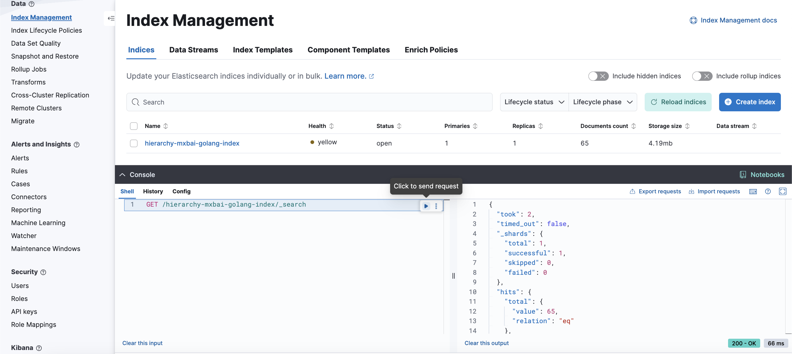

# How to run this example

Ref: https://www.elastic.co/guide/en/elasticsearch/reference/current/docker.html

## Elastic
To store embeddings in Elasticsearch using the Golang client, you'll need to follow these steps:

**Start Elasticsearch and Kibana**
```bash
docker compose up -d
```

Wait for some seconds until the services are up and running.

> To stop the Docker Compose stack, run: `docker compose down`

### Test the connection with the certificate

```bash
export ELASTIC_PASSWORD=iloveparakeets
curl -u elastic:$ELASTIC_PASSWORD http://localhost:9200
```

You should get something like this:
```bash
{
  "name": "elasticsearch",
  "cluster_name": "docker-cluster",
  "cluster_uuid": "rQ1ybvgUQNOVvJr2AuaiKw",
  "version": {
    "number": "8.17.0",
    "build_flavor": "default",
    "build_type": "docker",
    "build_hash": "2b6a7fed44faa321997703718f07ee0420804b41",
    "build_date": "2024-12-11T12:08:05.663969764Z",
    "build_snapshot": false,
    "lucene_version": "9.12.0",
    "minimum_wire_compatibility_version": "7.17.0",
    "minimum_index_compatibility_version": "7.0.0"
  },
  "tagline": "You Know, for Search"
}
```

## Run the samples

This example demonstrates how to store embeddings in Elasticsearch and perform a vector similarity search using the Go client.

### Create the embeddings

```bash
go run create-embeddings/main.go
```

### Check if the embeddings are stored

- Go to Kibana: http://localhost:5601/app/management/data/index_management/indices
- Log in with the user "elastic" and password "iloveparakeets"
- Open the console and run the following query:
    ```bash
    GET /hierarchy-mxbai-golang-index/_search
    ```
You should see the embeddings stored in the index `hierarchy-mxbai-golang-index`:



### Perform a vector similarity search

```bash
go run use-embeddings/main.go
```

[This program](use-embeddings/main.go) completes the prompt:
> Summarize what's new with benchmarks in 3 bullet points. Be succinct

If everything works, you'll see it answered from embeddings derived from [go1.24.md](create-embeddings/go1.24.md).

While your results may vary, here's an example output:
```bash
$ go run use-embeddings/main.go
🔎 searching for similarity...
📝 doc: 14 score: 1.6456556
📝 doc: 8 score: 1.6259755
📝 doc: 2 score: 1.5675237

🤖 answer:
Here are 3 bullet points summarizing the new benchmark features:

* Use `b.Loop()` instead of traditional loops for benchmark iterations.
* Expensive setup and cleanup steps execute only once per -count.
* Function call parameters and results are kept alive to prevent optimization.
```
